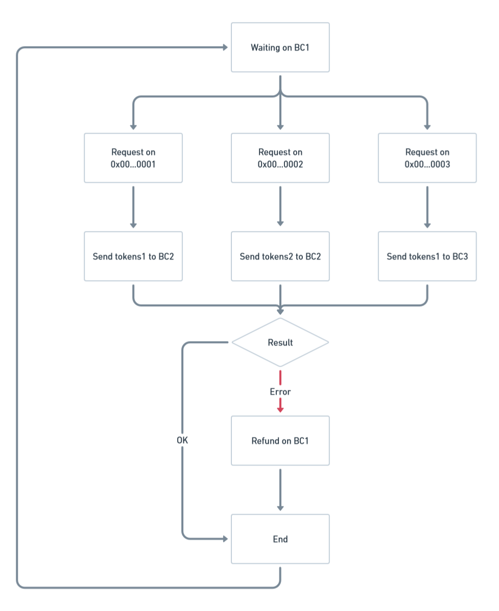
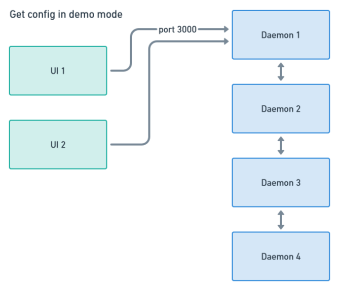
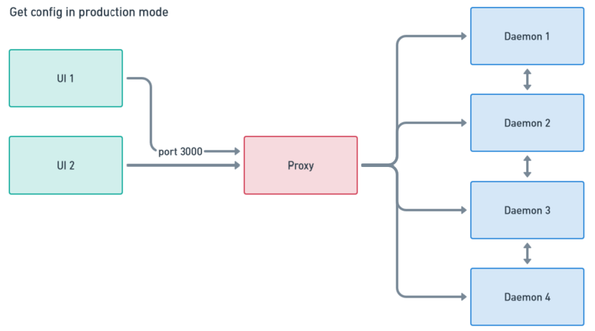

# Daemon Bridge

An on-chain asset bridge for converting ERC-20 tokens between EVM-compatible blockchains without smart contracts or interfaces.

## Features

- Direct wallet-to-wallet transfers without intermediary contracts
- No user interface requirement - interact directly through wallet transactions
- Chain-agnostic - works with any EVM-compatible blockchain
- Transaction traceability via hash references
- Minimum code footprint (<1000 lines)
- High security through proxy architecture

## Security Features

- No smart contracts to exploit
- No oracles required
- No direct daemon access except via proxy
- All operations conducted through blockchain transactions
- Proxy-based security model

## Prerequisites

- Node.js 16+
- npm or yarn
- Access to EVM blockchain RPC endpoints

## Installation

```bash
npm install
```

## Configuration

1. Create `.env` file with required keys:
```env
ETHERSCAN_API_KEY="your_etherscan_api_key"
INFURA_API_KEY="your_infura_api_key"
OPSepolia_PRIVATE_KEY="your_op_sepolia_private_key"
```

2. Configure networks and tokens in `config/config.json`
3. See `doc_dev.md` for detailed configuration instructions

## Usage

### Single Server Mode
```bash
npm start
```
Launches server on port 3000

### Demo Mode (Multiple Servers)
```bash
npm run daemon1  # Port 3000
npm run daemon2  # Port 3001
npm run daemon3  # Port 3002
npm run daemon4  # Port 3003
```

## Supported Networks & Tokens

Currently supporting Sepolia testnet as the source network:

| Token | Listener Address | Destination Network | Destination Token |
|-------|-----------------|-------------------|------------------|
| LINK | 0x962aC815B1249027Cfd80D6b0476C9090B5aeF39 | Optimism Sepolia | LINK |
| LINK | 0x71f7aaB7f69a4Cc5509903C2585FC84ecaba5485 | Arbitrum Sepolia | LINK |
| LINK | 0xF3842962562138C466649B19dEfc3C305af6BA64 | Base Sepolia | LINK |

## Architecture

### Working Principle


### Network Configurations
Demo Mode:


Production Mode:


## Development

### Project Structure
```
├── config/          # Configuration files
├── images/          # Architecture diagrams
├── hardhat-test/    # Test environment
└── doc_dev.md       # Developer documentation
```

### Testing
```bash
cd hardhat-test
npx hardhat test
```

## Error Handling

- Automatic transaction validation
- Failed transaction refunds
- Network disruption recovery
- Balance verification

## Troubleshooting

1. Server won't start:
   - Verify environment variables
   - Check network RPC endpoints
   - Ensure sufficient gas balance

2. Failed transactions:
   - Monitor gas prices
   - Verify token approvals
   - Check network status

## Contributing

1. Fork the repository
2. Create feature branch: `git checkout -b feature-name`
3. Commit changes: `git commit -am 'Add feature'`
4. Push branch: `git push origin feature-name`
5. Submit Pull Request

## License

MIT License

## Support

- [W3HC Discord server](https://discord.com/channels/753223385948880961/1224720192488210584)
- [Docs](doc_dev.md)